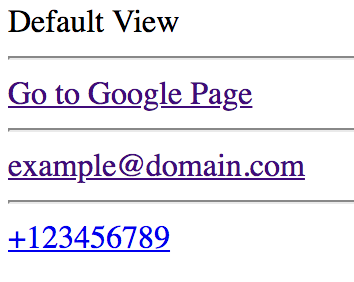

## Anchor

| Property              | Description                     |
| --------------------- | ------------------------------- |
| Tag name              | a                               |
| Required attributes   | href                            |
| Optional attributes   | global                          |
| Has close tag?        | yes                             |
| Is group tag?         | no                              |
| Child tags            | none                            |
| Element type          | Inline-level                    |
| Has default styles?   | yes, if only there is a content |
| Permitted parent tags | can be any except same tag      |

---

**description**

- used to create a link between the pages / within the page
- Also, it will support to open the default mailers when we have the `mailto:` prefix in the `href` attribute
- Also, it wil support to open the default dialer when we have the `tel:` prefix int he `href` attribute
- for more: https://developer.mozilla.org/en-US/docs/Web/HTML/Element/a

**Tag omissions**

```
None
```

**syntax**

```html
<a href="https://www.google.com">Go to Google Page</a>
```

**actions**

- used to navigate the page
- there is a default css for normal state, visited state and click state (everything are color changes only)

---

## preview



---

## examples

```html
<!-- Default View: -->
<a>Default View</a>

<!-- external location / absolute url -->
<a href="https://www.google.com">Go to Google Page</a>

<!-- another section in the section (like hashtag) -->
<a href="#samepage">Internal</a>

<!-- preventing from navigation -->
<a href="#">Preventing Navigation</a>

<!-- different page in same project -->
<a href="anchor.html">Go to Anchor Page</a>

<!-- used to open mail app which is set by default in our machine -->
<a href="mailto:example@domain.com">example@domain.com</a>

<!-- used to open default dialers based on the device -->
<a href="tel:+123456789">+123456789</a>
```
