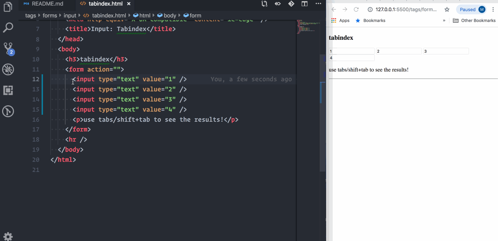

## Input

| Property            | Description                             |
| ------------------- | --------------------------------------- |
| Tag name            | input                                   |
| Required attributes | type, name, value, id                   |
| Optional attributes | readonly, required, disabled, autofocus |
| Has close tag?      | no                                      |
| Is group tag?       | no                                      |
| Child tags          | no                                      |
| Element type        | inline                                  |
| Has default styles? | yes                                     |

---

**description**

- create interactive controls for web-based forms
- accepts the data from the user
- ui and controls will be vary based on the user agent (browser)

- types:

  | type           | usage                                                  |
  | -------------- | ------------------------------------------------------ |
  | text           | creates plain text field                               |
  | password       | creates password field                                 |
  | checkbox       | creates checkbox field                                 |
  | radio          | creates radio field                                    |
  | tel            | creates telephone field                                |
  | email          | creates email field                                    |
  | number         | creates number field with increment decrement arrows   |
  | range          | creates range slider                                   |
  | button         | creates buttons with type of submit, reset and button  |
  | file           | used to load the files from local                      |
  | image          | creates graphical submit button                        |
  | color          | creates color option with picker when clicked          |
  | search         | creates search box with close icon                     |
  | url            | creates url input box with minimal protocol validation |
  | date           | create date picker, with no time and time zone         |
  | time           | used to enter the time with no time zone               |
  | datetime-local | creates date picker and time with no time zone         |
  | month          | create date picker but only allows to select month     |
  | week           | create date picker but only allows to select week      |
  | hidden         | used to hide the input box                             |

- for more: https://developer.mozilla.org/en-US/docs/Web/HTML/Element/input

**syntax**

```html
<input type="text" name="txt" value="plain text" />
```

**useful attributes**

| Property    | values     | Description                                   |
| ----------- | ---------- | --------------------------------------------- |
| autofocus   | true/false | used to enable auto highlight by default      |
| disable     | true/false | used to disable the input box                 |
| readonly    | true/false | allows only to read                           |
| required    | true/false | make the field as mandatory                   |
| tabindex    | -1, 0, n   | to control tab / shift + tab on the autofocus |
| placeholder | string     | used to set placeholder text                  |
| minlength   | number     | used to minimum length of the character       |
| maxlength   | number     | used to maximum length of the character       |

---

## examples

- **Defaults:** index.html

  - some useful attributes can be seen here

- **Required:** required.html

  - we can see how the required attribute is working

- **suggestion-list:** suggestions-list.html

  - example of suggestion list with input box

- **tab-index:** tabindex.html

  - example of tabindex and the working flow

- **types:** types.html

  - all the types of input tag

## Special Notes:

### How the tabindex is working?

- **-1:** skip the focus / focus will not be shown
- **0:** default value is 0, browser will take care of the focusing order when clicking on the **tab and shift + tab** keys
- **n:** its a positive value to define the order of the focus

**work flow**

- as said above, **-1** will skip the focusing
- but, take this kind of scenarios: we have a 4 elements and their `tabindex` is following like below then:

**default flow with no tabindex**



---

**customized tabindex + focus start from URL + with serial numbers including 0**


---

**customized tabindex + focus start from document + with serial numbers including 0**


---

**customized tabindex + focus start from URL + re-ordered numbers**


---

**customized tabindex + focus start from document + re-ordered numbers**


---

### How to pair the label and form element?

- instead of using `placeholder` we should use `label` tag that will help on the semantic area.
- so, for paring the label and the field tag we need to use two attributes `for` and `id`
- `for` attribute for label, `id` attribute for form field

```html
<form action="">
  <label for="firstname">First Name</label>
  <input id="firstname" />
</form>
```
