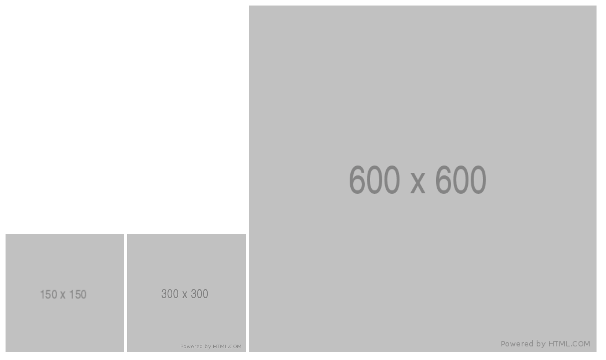

## Image

| Property              | Description  |
| --------------------- | ------------ |
| Tag name              | img          |
| Required attributes   | src          |
| Optional attributes   | global       |
| Has close tag?        | no           |
| Is group tag?         | no           |
| Child tags            | none         |
| Element type          | inline-level |
| Has default styles?   | no           |
| Permitted parent tags | can be any   |

---

**description**

- used to render/embed a image into your document
- supported file formats:

  - JPEG/JPG
  - GIF, including animated GIFs
  - PNG
  - SVG
  - BMP

- for more: https://developer.mozilla.org/en-US/docs/Web/HTML/Element/img

**Tag omissions**

```
none
```

**syntax**

```html

```

**useful attributes**

| Property | values                 | Description                                    |
| -------- | ---------------------- | ---------------------------------------------- |
| alt      | custom value as string | alternate text when image is not loading       |
| width    | in px                  | set width                                      |
| height   | in px                  | set height                                     |
| srcset   | img url                | loads HD images based on the device resolution |
| sizes    | media query css        | resize the image based on the media query      |

- examples:

  - alt

  ```html
  
  ```

  - width and height

  ```html
  
  ```

  - srcset

  ```html
  
  ```

  - srcset + sizes

  ```html
  
  ```

---

## preview



---

## examples

```html

```
